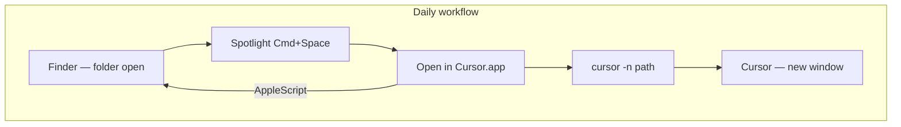

  

  <strong>Open in Cursor</strong>

  macOS utility that opens the current Finder folder in Cursor in a new window.

  
  
  
  

  <em>Download the .dmg, drag it to Applications, launch from Spotlight.</em>

---

## Open in Cursor

Open in Cursor is a lightweight macOS app that bridges Finder and Cursor: open a folder in Finder, launch the app from Spotlight, and Cursor opens that directory in a **new window**.

### How it works

The app reads the front Finder window path and invokes the `cursor` CLI:

- **Spotlight**: launch with `Cmd+Space` → "Open in Cursor"
- **Finder automation**: macOS asks for permission to control Finder (one-time)
- **Cursor CLI**: opens the folder with `cursor -n <path>` (uses the CLI bundled inside Cursor.app when needed)

### Features

- **Spotlight**: install to `/Applications`, searchable immediately
- **New Cursor window**: uses `-n` instead of reusing an existing window
- **Universal binary**: native on Apple Silicon and Intel
- **Permission guide**: in-app dialog with **Request Permission** and **Open Settings**
- **Team distribution**: `.dmg` published on GitHub Releases
- **CI/CD**: GitHub Actions tests on every push; **automatic release on every tag push**

## Quickstart

### Download

**[Download latest (OpenInCursor.dmg)](https://github.com/TheLand/open-in-cursor/releases/latest/download/OpenInCursor.dmg)**

All releases: [github.com/TheLand/open-in-cursor/releases](https://github.com/TheLand/open-in-cursor/releases/latest)

Requirements: [macOS 13+](https://www.apple.com/macos/) · [Cursor](https://cursor.com) installed

### Installation

1. Open the downloaded `.dmg`
2. Drag **Open in Cursor** to **Applications**

### Finder permission

On first use:

1. Click **Request Permission** in the app dialog
2. In the **macOS** system dialog, click **OK** or **Allow**
3. If needed, enable **Finder** under **System Settings → Privacy & Security → Automation**

> **Note:** "Open in Cursor" only appears in Automation **after** you click "Request Permission".

### Verify

1. Open Finder on a working folder
2. `Cmd+Space` → type **Open in Cursor** → Enter
3. Cursor opens in a new window on that folder

No extra setup is required if Cursor is installed in **Applications**. The optional `cursor` shell command is only needed for terminal use.

## Troubleshooting

| Problem | Solution |
| --- | --- |
| "No Finder window is open" | Open at least one Finder window on a folder |
| "Cursor not found" | Install [Cursor](https://cursor.com) to Applications |
| Finder permission denied | **Request Permission** → Allow in the system dialog → **Open Settings** |
| Open in Cursor missing in Automation | Click **Request Permission** first, then reopen Settings |
| Stale permissions (`env`, `bash`) | Disable those entries in Automation, or run `tccutil reset AppleEvents com.openincursor.app` and relaunch |
| App not in Spotlight | Wait ~1 minute after install, or restart Finder |
| macOS blocks the app | Right-click → Open, or `xattr -cr "/Applications/Open in Cursor.app"` |

## Documentation

- **[Development](docs/development.md)** — build, test, Git hooks, releases, contributing
- **README** (this file) — installation and troubleshooting

### Updates

Download the [latest release](https://github.com/TheLand/open-in-cursor/releases/latest/download/OpenInCursor.dmg) and replace the app in **Applications**.

### Contact

Open a [GitHub issue](https://github.com/TheLand/open-in-cursor/issues) for bugs or feature requests.

## Acknowledgments

Inspired by [OpenInCode](https://github.com/sozercan/openincode) — a macOS Finder toolbar app to open the current folder in Visual Studio Code.
